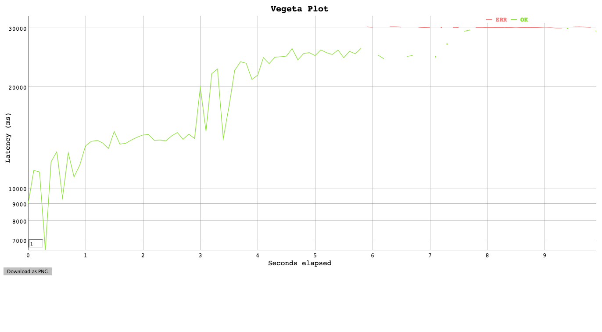

# Backlog Reporter

This gem monitors the size of the web server internal request backlog. (The backlog is requests whose socket has been accepted, but which are not yet being processed by the web server.) Once the request backlog exceeds a certain threshold, a flag file is touched. This flag file can be monitored by a fronting web server (e.g. Nginx) to proactively return 503 Service Unavailable, so that the backlog does not grow further. Once the request backlog falls back below the threshold, the flag file is deleted.

The rapid 503 response prevents the backlog from growing without bound, and it prevents the server from trying to process too many requests in parallel. When the server is trying to process too many requests at once, the average latency starts to climb and all clients start to see longer and longer response times.

# Requirements

Currently, `backlog_reporter` works only with the Puma web server. 

# Example

Here's an example of a web service whose behavior was improved with the Backlog Reporter.

## Without Backlog Reporter

At the 10 request per second rate, the response time starts to degrade until it climbs above 20 seconds per request and the remainder of the requests time out.



## With Backlog Reporter

Once the server starts to become overloaded, it degrades in a predictable way. The average response time increases to about 5 seconds; however, it does not increase further from this level. With client retry, all requests will eventually be served successfully.


(Note: The performance of this application was also improved at the same time; that's why even the initial responses are faster).

## Installation

Add this line to your application's Gemfile:

```ruby
gem 'backlog_reporter'
```

And then execute:

    $ bundle

Or install it yourself as:

    $ gem install backlog_reporter

## Usage

In rails config:

```ruby
  config.backlog_reporter.flag_path = '/run/app/congested.flag'
  config.backlog_reporter.max_backlog = 16
  config.backlog_reporter.check_interval = 0.01 # seconds
```

In nginx config:

```
  location / {
    proxy_pass http://localhost:300;

    if (-f /run/app/congested.flag) {
      return 503;
    }
  }
```

## Development

After checking out the repo, run `bin/setup` to install dependencies. Then, run `rake spec` to run the tests. You can also run `bin/console` for an interactive prompt that will allow you to experiment.

To install this gem onto your local machine, run `bundle exec rake install`. To release a new version, update the version number in `version.rb`, and then run `bundle exec rake release`, which will create a git tag for the version, push git commits and tags, and push the `.gem` file to [rubygems.org](https://rubygems.org).

## Contributing

Bug reports and pull requests are welcome on GitHub at https://github.com/conjurinc/backlog-reporter.

